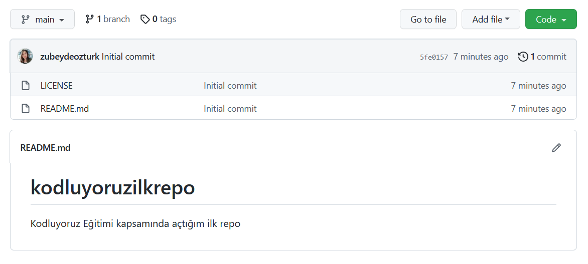

# kodluyoruzilkrepo
Bu repo [Kodluyoruz](https://www.kodluyoruz.org) Front-end kapsamında ilk oluşturduğum repodur.İçerisinde bir adet html,bir README dosyası ve bir resim bulundurmaktadır.

## proje resim


## Installation
```
git clone https://github.com/zubeydeozturk/kodluyoruzilkrepo.git
```

## Usage
Linux için:
```linux
cd kodluyoruzilkrepo
code .
```

## Contributing
Pull requestler kabul edilir. Büyük değişiklikler için, lütfen önce neyi değiştirmek istediğinizi tartışmak için bir konu açınız.

## License
[MIT](https://choosealicense.com/licenses/mit/)
